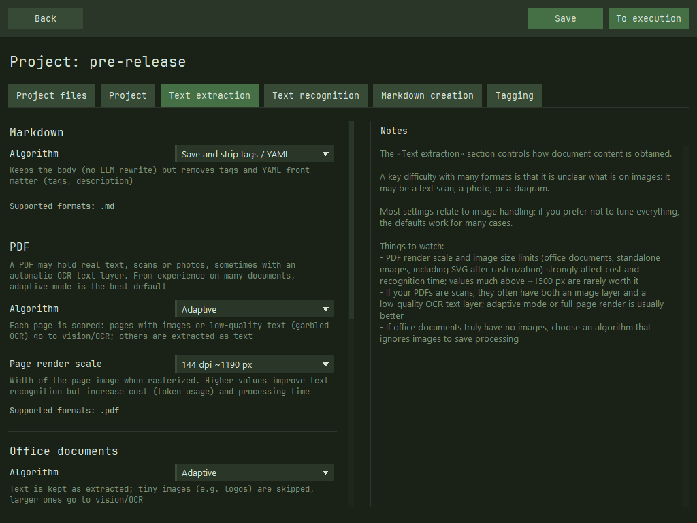

# unidoc2md

A lightweight app that converts documents in various formats into Markdown. You can use the output in a personal knowledge base or add it to project files for LLM chat workflows.

## Features
- Extracts text and images from documents, normalizes them, and sends them to Vision/OCR models for text extraction
- Normalizes the resulting text into strict `markdown` using your instructions
- Tags documents in sequence and adds short descriptions
> Each processing stage is cached separately, so you can safely add new files to a project

## LLM provider support
- Major Vision LLM providers: `OpenAI`, `Anthropic`, `Google`, `xAI`
- Local models via `LM Studio` or a compatible API
- Limited OCR provider support: `Yandex OCR`

> The model list is not hard-coded; the app includes a UI to refresh it. If you enter token pricing, the app shows request cost while you work

## Supported formats
The app can handle:
- Plain text: `.txt`, `.md`
- Office documents, including with images: `.docx`, `.odt`
- PDF files and scans: `.pdf`
- Images: `.png`, `.jpg`, `.jpeg`, `.webp`, `.bmp`, `.gif`, `.tif`, `.tiff`, `.svg`

## Install and run
Download and run the [latest release](https://github.com/TurkovBogdan/unidoc2md/releases).
Only **Windows** is supported for now; releases for other operating systems will follow.

> Note: the app is in alpha—expect bugs or rough edges, but core functionality is stable; it has been tested on roughly 200 documents and scans

## Developer documentation
- [Manual build guide](manual-build.md)
- [Project structure](project-structure.md)
- [File extraction module](file-extract-module.md)
