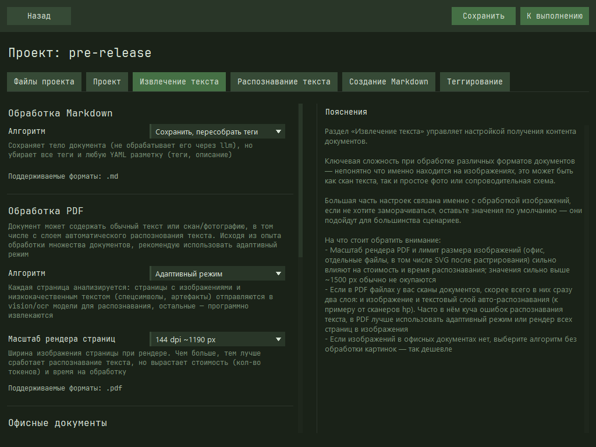

# unidoc2md

Простенькое приложение для преобразования документов разных форматов в Markdown документы. Результат можно использовать в личной базе знаний или загружать в файлы проекта для чатов с LLM.

## Возможности
- Извлекает из документов текст и изображения, нормализует их и передаёт в Vision/OCR модели для извлечения текста
- Нормализует полученный текст в строгий `markdown` формат по пользовательским инструкциям
- Последовательно тегирует документы, добавляет к ним краткое описание
> Каждый этап обработки файла кешируется отдельно, можно безопасно добавлять новые файлы к проекту

## Поддержка LLM-провайдеров
- Доступны основные провайдеры Vision LLM: `OpenAI`, `Anthropic`, `Google`, `xAI`
- Вы можете использовать локальные модели через `LM Studio` или совместимый API
- Ограниченная поддержка провайдеров OCR: `Yandex OCR` 

> Список моделей не зашит в приложение, в нём доступен интерфейс для актуализации списка моделей. Если заполнить стоимость токенов, приложение будет отображать стоимость запросов в процессе работы

## Поддержка форматов
Приложение умеет обрабатывать следующие форматы документов:
- Простые текстовые форматы: `.txt`, `.md`
- Офисные документы, в том числе с изображениями: `.docx`, `.odt`
- PDF файлы и сканы: `.pdf`
- Изображения: `.png`, `.jpg`, `.jpeg`, `.webp`, `.bmp`, `.gif`, `.tif`, `.tiff`, `.svg`

## Установка и запуск
Скачайте и запустите [последний релиз](https://github.com/TurkovBogdan/unidoc2md/releases) приложения.
Сейчас поддерживается только `os windows`, релизы под остальные операционные системы будут позднее

> Важно: приложение находится в альфа-релизе, возможны баги или недоработки, но основной функционал работает стабильно, успел проверить работу на ~200 документах и сканах

## Документация для разработчиков
- [Инструкция по сборке приложения](manual-build.md)
- [Структура приложения](project-structure.md)
- [Описание модуля извлечения контента](file-extract-module.md)