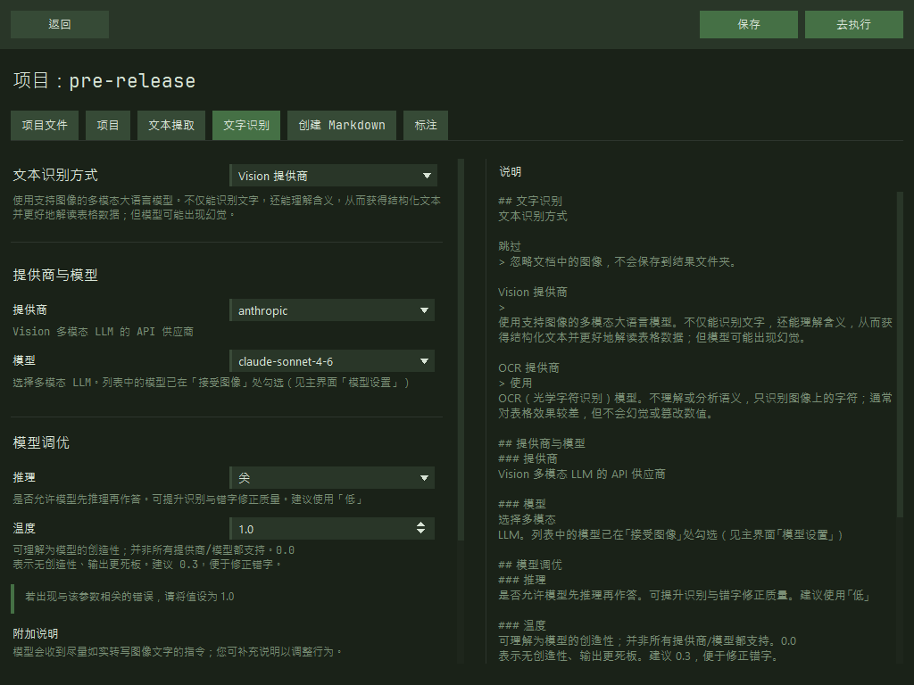

# unidoc2md

一款轻量应用，可将多种格式的文档转换为 Markdown。输出可用于个人知识库，或加入项目文件以供与 LLM 对话使用。

## 功能
- 从文档中提取文本与图片，规范化后送入 Vision/OCR 模型以识别文字
- 按你的说明将所得文本规范为严格的 `markdown` 格式
- 依次为文档打标签并生成简短描述
> 每个处理阶段单独缓存，可安全地向项目添加新文件

## LLM 提供商支持
- 主流 Vision LLM：`OpenAI`、`Anthropic`、`Google`、`xAI`
- 通过 `LM Studio` 或兼容 API 使用本地模型
- OCR 提供商支持有限：`Yandex OCR`

> 模型列表未写死在程序中，界面内可刷新列表。若填写 token 单价，运行过程中会显示请求成本

## 支持的格式
应用可处理：
- 纯文本：`.txt`、`.md`
- Office 文档（含图片）：`.docx`、`.odt`
- PDF 与扫描件：`.pdf`
- 图片：`.png`、`.jpg`、`.jpeg`、`.webp`、`.bmp`、`.gif`、`.tif`、`.tiff`、`.svg`

## 安装与运行
下载并运行[最新发布版](https://github.com/TurkovBogdan/unidoc2md/releases)。
目前仅支持 **Windows**；其他系统的发行版将陆续提供。

> 说明：应用处于 alpha 阶段，可能存在缺陷或未完善之处，但核心功能已较稳定；已在约 200 份文档与扫描件上验证

## 开发者文档
- [手动构建说明](manual-build.md)
- [项目结构](project-structure.md)
- [文件提取模块](file-extract-module.md)
